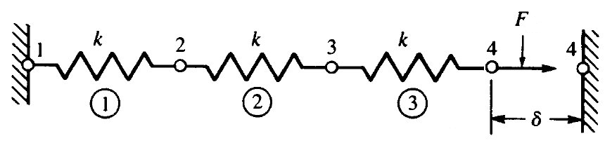
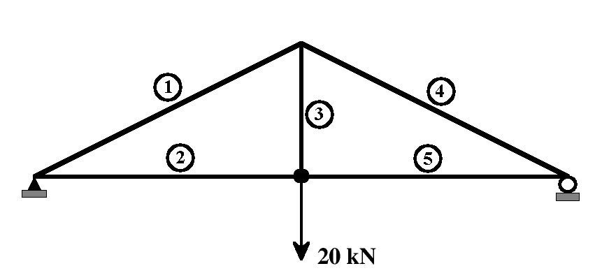

# Guía 6

1. Se desplaza el punto final del sistema de resortes mostrado en la figura, hasta unirlo a la pared. Todos los resortes tienen constantes $k~=~200~kN/m$, siendo el desplazamiento final de $\delta~=~20~mm$. Determine los desplazamientos de cada uno de los nodos, las fuerzas en cada elemento y las fuerzas globales (reacción de la pared y **F**).

    

1. Considere el entramado mostrado en la figura, con una fuerza aplicada de $20~kN$. Calcule los desplazamientos de cada uno de los nodos y las tensiones que sufre cada elemento. Todos los elementos tienen $E~=~210~GPa$ y una sección de $10~cm^2$, excepto el elemento 3, que tiene una sección de $20~cm^2$. Los elementos 2 y 5 tienen una longitud de 8 metros y el elemento 3 de 4 metros.

    
